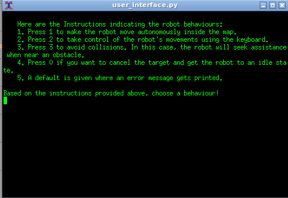
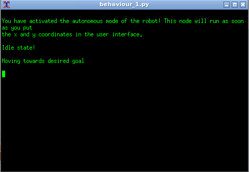
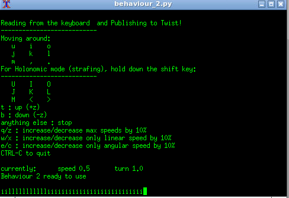
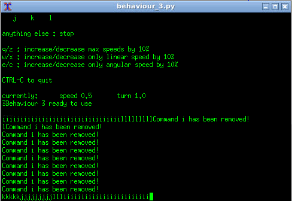
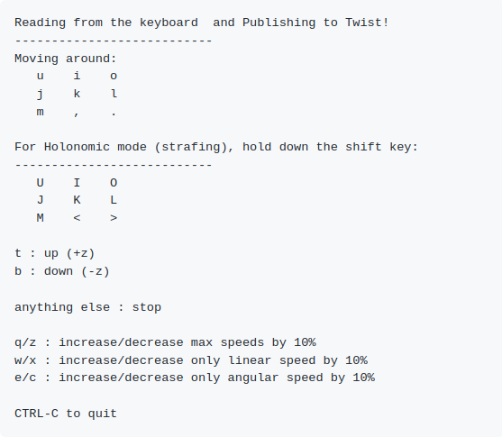
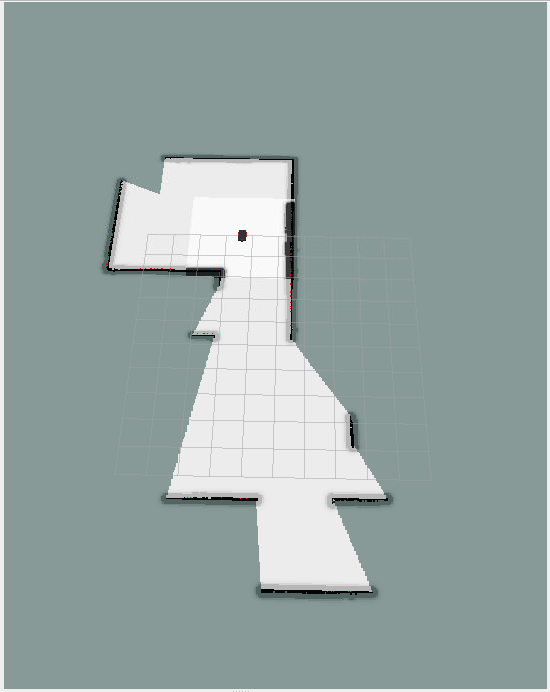
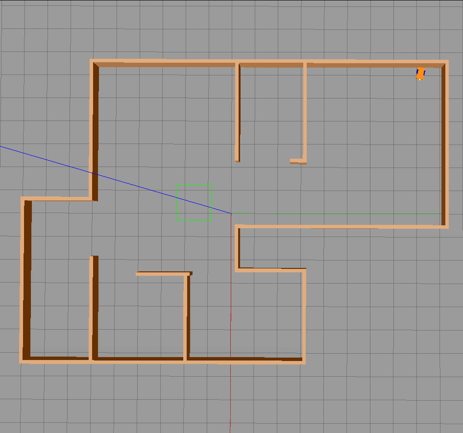
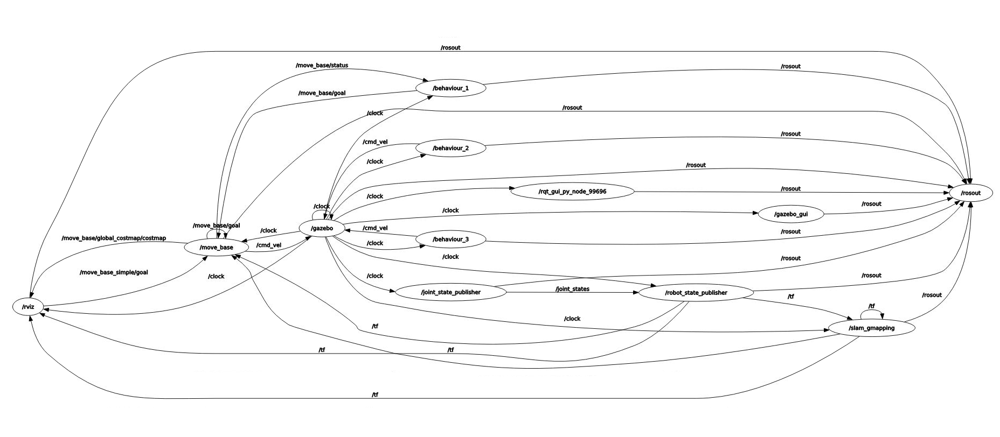
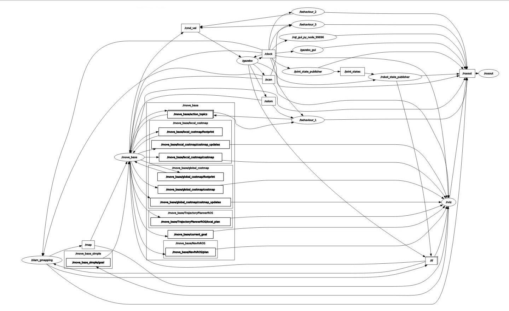

# RT1 Assignment 3
## INTRODUCTION

The final assignment is focused on developing a software architecture for the control of the robot in the environment. The software will rely on the move_base and mapping packages for localizing the robot and plan the motion.

The architecture requests an input from the User, and lets the robot execute one of the following behaviours:

1. Autonomously reach a x,y coordinate inserted by the user.
2. Lets the user drive the robot with the keyboard
3. Let's the user drive the robot assisting them to avoid collisions.

All the nodes created in this assignment were made in python.

### INITIAL SETUP BEFORE STARTING TO CODE

The steps to be carried prior to creating the nodes would be as follows:

1. Create your workspace. In my case I called it RT1_Assignment3
2. Then create a src folder with RT1_Assignment3
3. Perform catkin_make

```bash
mkdir RT1_Assignment3
cd RT1_Assignment3
mkdir src
catkin_make
```
**Remember to source your workspace. You can do it either by using the .bashrc file or just source it within the terminal itself. The best practice it to source it in the bashrc file.**

To carry out this assignment, the following packages are required:

1. [final_assigment](https://github.com/CarmineD8/final_assignment.git)
2. [slam_gmapping](https://github.com/CarmineD8/slam_gmapping.git)

To perform this assignment, I used the docker created by Prof. Carmine. So the dependencies I needed to initially start off with this assignment were already included in it. All that is needed to be done is to go to the src folder of the workspace and clone the repositories containing the final_assignment and the slam_gmapping.
```bash
cd src
git clone https://github.com/CarmineD8/final_assignment.git
git clone https://github.com/CarmineD8/slam_gmapping.git
```
**Remember:** Once the repositories are cloned, we must check out to noetic.
```bash
git checkout noetic
```
That's all that is needed for the initial setup! Now to utilizing the Final_Assignment folder that was cloned.
### FINAL_ASSIGNMENT
The final assignment folder contains a series of folders that have to do with the creation of the map, the robot, configurations, parameters, and a CMakeLists.txt and package.xml. For this assignment, the focus remained only on the launch and scripts folders.

The launch file contains 4 launch files, 2 of which was created by me to launch nodes and all launch files in the folder.

**nodes_four.launch**

This launch file contains parameters and nodes.
```bash
<?xml version="1.0"?>
<launch>

<param name="active" type="int" value="0"/>
<param name="des_pos_x" type="double" value="1"/>
<param name="des_pos_y" type="double" value="1"/>

<node pkg="final_assignment" type="user_interface.py" name="user_interface" required="true" launch-prefix="xterm -bg black -fg green -e"/>
<node pkg="final_assignment" type="behaviour_1.py" name="behaviour_1" required="true" launch-prefix="xterm -bg black -fg green -e"/>
<node pkg="final_assignment" type="behaviour_2.py" name="behaviour_2" required="true" launch-prefix="xterm -bg black -fg green -e"/>
<node pkg="final_assignment" type="behaviour_3.py" name="behaviour_3" required="true" launch-prefix="xterm -bg black -fg green -e"/>
</launch>
```
The other two nodes came with the package. They are as follows:

1. **simulation_gmapping**: This launch file adds the description of the robot to the ROS parameter server, launches Gazebo and Rviz amongst other nodes and generates the robot in the simulation.
2. **Move_base**: Sets the rosparam described in the yaml file located in the param folder and launches the move_base node.

**final.launch**
```bash
<?xml version="1.0"?>
<launch>
    <include file="$(find final_assignment)/launch/simulation_gmapping.launch"/>
    <include file="$(find final_assignment)/launch/move_base.launch"/>
    <include file="$(find final_assignment)/launch/nodes_four.launch"/>
</launch>
```

The scripts folder contains 4 nodes to perform the 3 behaviours mentioned at the beginning of this file. They are as follows:

1. user_interface
2. behaviour_1
3. behaviour_2
4. behaviour_3

**Remember:** In order to have these nodes running, it is extrememly important to make the respect files executable. This can be done with the command:
```bash
chmod +x user_interface.py
chmod +x behaviour_1.py
chmod +x behaviour_2.py
chmod +x behaviour_3.py
```

In order to work on this assignment, I have used **actionlib** instead of services. It is similar to services in teh sense that it sends a request to an action server in order to achieve some goal and will get a result. But unlike servies, while the action is being performed, an action server sends progress feedback to the client. Actions are useful when a response may take a significant length of time.

I have also used the **move_base** package as it provides an implementation of an action that, given a goal in the world, will attempt to reach it with a mobile base. The move_base node links together a global and local planner to accomplish its global navigation task.

Also, I have imported the **tf** package as it lets the user keep track of multiple coordinate frames over time. tf maintains the relationship between coordinate frames in a tree structure buffered in time, and lets the user transform points, vectors, etc between any two coordinate frames at any desired point in time.

### THE NODES
#### NODE 1: user_interface


The user_interface takes input commands from the user. The user gets to choose amongst 3 behaviours mentioned earlier. So, the user_interface node is capable of switching between nodes by setting the ros parameter. The value of *active* is updated whenever the user chooses a behaviour and that would run the specific node associated with it.

#### NODE 2: behaviour_1


This node focuses on the making the robot drive autonomously. It uses the MoveBaseAction. The move_base node provies an implementation og the SimpleActionServer, that takes in goals containing geometry_msgs/PoseStamped messages. There is a possibility of having a communication with the move_base node over ROS directly, but the recommended way to send goals to move_base only if one would care about tracking their status is by using SimpleActionClient. The functions defined here are as follows:

1. clbk_odom -> It is responsible to get the current position of the robot in teh environment.
2. goal_status -> That tells us what the progress of the goal is. There are different states to it but we focused only when the state was 3 as that would define that the goal was achieved successfully by the action server.
3. goalsetto_action_client -> That sends the desired x and y coordinates of the desired position to the client.
4. main -> Where the initialization of the node takes place and the it loops, updates the variables including the position and behaviour of the robot. 

#### NODE 3 and 4: behaviour_2 and behaviour_3
 

Both these nodes make use of the fact the robot is controlled using the keyboard. In order to do be able to use the keyboard, one would have to install it:
```bash
sudo apt-get install ros-noetic-teleop-twist-keyboard
```
Teleop-twist-keyboard is a generic Keyboard Teleop for ROS. For Node 3 it is used when the value of active is changed based on teh user input. This behaviour is completely manual and would allow the user to navigate across the map based on the controls given as instructions when the terminal loads.



There is hardly any difference between Node 3 and 4 except for the fact that node 4 uses a callback function where information about obstacles are constantly sent to the robot making sure that when it is within certain distance from the obstacle it stops. Also to make it more interesting, pop function was used. Ideally if not mentioned in the pop function, the last element of the dictionary gets eliminated. But here using the pop function, I have ensured that based on the location of the obstacle relative to the robot, certain commands get disabled just so that the user cannot drive into the obstacle. 

## Simulation

If all the steps have been followed until now, then the last remaining thing to do is to perform the simulation. The following commands need to be inserted:
```bash
# After writing all the nodes, go to the beginning of the workspace
cd ./path/to/beginning/of/final_assignment/folder
# As a habit I use killall -9 roscore and then killall -9 rosmaster so I can start fresh
killall -9 roscore
killall -9 rosmaster
catkin_make
roscore &
rospack profile # Just to see packages
roslaunch final_assignment final.launch
```
 
This would open Rviz which is visualizer where you can put obstacles and see what the robot sees or see how the laser sensor works. Once Rviz opens, almost simultaneously gazebo opens. Gazebo is the official simulator for ROS. This is where once can see what exactly the robot is doing in the environment. Because of the launch file final,4 terminals showing the 4 nodes will open and then user can give the input commands.

While all nodes are running, one can have a look at the way the nodes and topics communicate with each other by using the following command on a separate terminal:
```bash
rosrun rqt_graph rqt_graph
```
It will show the following graphs:
**Nodes Only**


**Nodes and Topics**


## PseudaCode
### user_interface
```python
import all necessary libraries

Initialize a flag to the node which when True will cancel the operation.

Create a function called MODE()

    if flag is true:
        It will display a command to show how to cancel an operation.
    
    Take input from the user

    For autonomous driving
    if input == 1:
        set the parameter active to 0 indicating idle behaviour
        get parameter active
   
        Take Input from the user for desired positions
        Values are in float
        set the desired x and y parameters and also the active parameter to 1
        flag = true
   
    elif input == 2:
        set active parameter to 2
        print command you want the user to see in the terminal that opens up
        get active parameter value
   
    elif input == 3:
        DO THE SAME AS DONE WHEN INPUT WAS 2. But in this case set the active parameter to 3.

    elif input == 0:
        DO THE SAME AS DONE WHEN INPUT WAS 2. But in this case set the active parameter to 0.

    else:
        print that the user has inputted wrongly.
   
Define main function
    Print user information and execute the MODE function
    
if __name__ == '__main__'
    Execute the main function
```

### behaviour_1
```python

Import necessary files including MoveBase related and tf and Odometry

Write the message you want to display. Print it in the main function

Initialize variable for MoveBaseGoal, desired x and y positions and flag for end goal. 
Also initialize active_ to 0

Define an odometry function that gets the present position of the robot in the environment.
State position variable

Give a definition to position variable

Define a function to find the goal status.
    There are 10 statuses with respect to the goal
    Put them in an if condition
    if status == 3
       Print that the goal has been achieved successfully
       Change value of flag for end goal to true

Define a function for setting goal to action client
    Get global variables goal and client
    goal is defined as MoveBaseGoal(). Use that for desired x and y coordinates
    Send the goal and goal status to the acion server

Define the main function
    set flag value and define global variables.
    
    The action client and server communicate over a set of topics, described in the actionlib protocol. 
    
    Initialize the node and print the message
    
    Subsribe to the Odometry to get position details
    
    Command to Wait until connected to the server. 
    
    Set frame_id to map and orientation to 1.0
    
    When the loop runs:
        get the active parameters and the desired x and y coordinates.
        
        if action == 1 and flag == 1:
            invoke the goalsetto_action_client function and then set the flag to 0
        elif action == 0:
            if flag is 0 and the flag_goal is False:
                Cancel the goal
            if flag_goal is True:
                set flag to 1 and then flag_goal to False
                
if __name__ == '__main__':
    Invoke main function
```

### behaviour 2
```python
   Take the code from teleop_twist_keyboard.py. Make the following changes to to it:
   1. Anything with respect to windows os has been taken away and only those with respect to 
      termios has been left. Termios module provides an interface to the Unix terminal control 
      facilities. It can be used to control most ascpects of the terminal communication ports. 
   2. Include a function inside the PublishingThread class that will stop the robot as well. I
      shall call it stop_robot_fnc() with a self arguement.
      Define stop_robot_fnc(self):
          # Copy paste the end part of the run function as it publishes to stop message when thread exits.
      
   3. Removed the part of code that involves stamped from the def run(self)
   4. Removed RestoreTerminalSettings()
   
   if __name__ == '__main__':
       Same as the teleop_twist_keyboard.py except we get the parameter value for active and put an if condition there to activate the keyboard.
       Activation of the keyboard is written in the py that was used to build this behaviour.
```
### behaviour 3
``` python
   Same as behaviour 2 except we define 2 new functions
   1. Laser_clbk(msg):
       define the range vectors for the front, left and right of the sensor.
       Use if conditions to set values for either of the 3 sides as false if the robot is too close to the obstacle.
   2. pop_fnc(MoveBindings):
       Function that uses if condition to disable an key if obstacle is infront, on the left or the right of it.
       example:
       When the obstacle is only in front of the robot
       if not front and left and right:
           elem_removed = MoveBindings.pop(i)
           This wont allow the robot to move forward.
       There are 7 conditions in total that have the exact format as the above one.
   The main function is the exact same as that of behaviour 2 except here after the node is initialized, we will have to subscribe to the Laser_clbk
   function.
   Also we need to create a dictionary which will be a copy of the moveBindings given at the beginning of the teleop py file.
```
## Video

Below is a gif demonstrating my work

